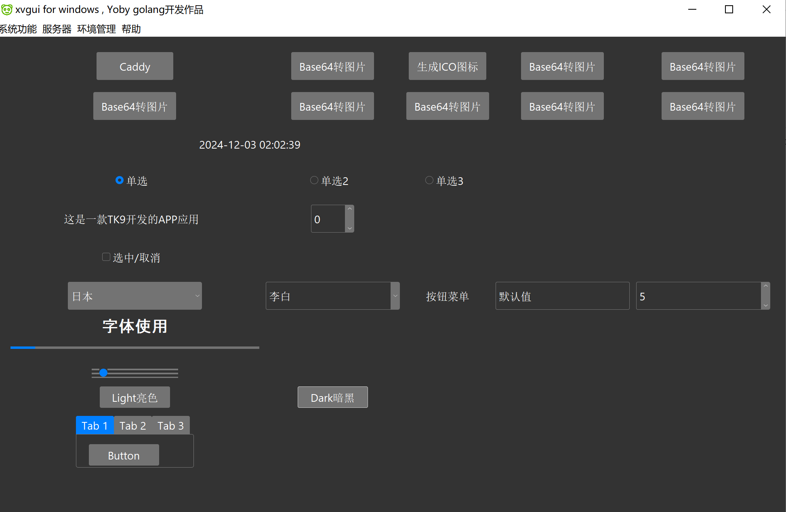
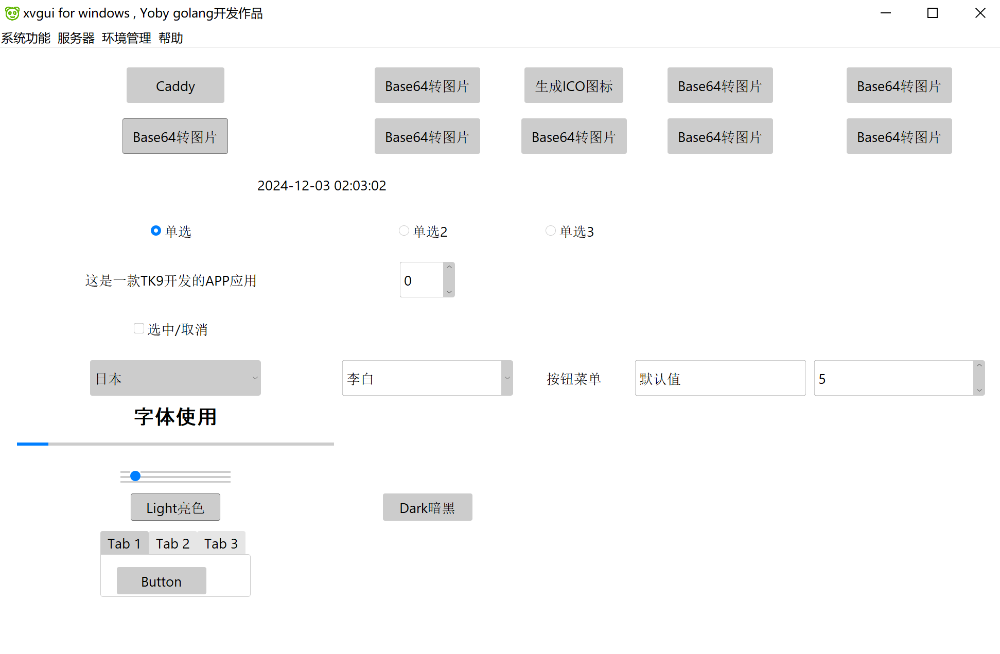

# golang版本的GUI开发包tk9.0
tcl/tk9.0版本的tk开发GUI,是一个正在完善的go gui开发包

### 特点
- 无cgo跨平台编译,支持win,macos,linux
- 官方地址 <https://gitlab.com/cznic/tk9.0> 这只是一个镜像
- 官方文档 <https://pkg.go.dev/modernc.org/tk9.0>
- 这是一个移植的2024-9-28发行的tcl/tk9.0版本,后续对托盘菜单,系统通知等肯定支持,目前golang gui在更新的库在这两方面表现都很差.
- 这个包编译的程序并不大也不含有任何第三方库,也无cgo,
- 经过测试目前支持菜单,文本框,文本域,打开,保存,调用对话框都能正常使用,托盘菜单,系统通知目前还没移植完成.可以编写一些GUI程序,漂亮效果目前只有按钮,等待官方继续开发
- 一个简单demo,编译后6M,使用`go build -ldflags "-s -w -H windowsgui"` upx压缩后5m,能够接受.
~~~
package main

import (
	. "modernc.org/tk9.0"
	"modernc.org/tk9.0/b5"
)

func main() {
	background := White
	primary := b5.Colors{b5.ButtonText: "#fff", b5.ButtonFace: "#0d6efd", b5.ButtonFocus: "#98c1fe"}
	secondary := b5.Colors{b5.ButtonText: "#fff", b5.ButtonFace: "#6c757d", b5.ButtonFocus: "#c0c4c8"}
	success := b5.Colors{b5.ButtonText: "#fff", b5.ButtonFace: "#198754", b5.ButtonFocus: "#9dccb6"}

	StyleThemeUse("default")
	opts := Opts{}
	Grid(TButton(Txt("Primary"), Style(b5.ButtonStyle("primary.TButton", primary, background, false))),
		TButton(Txt("Secondary"), Style(b5.ButtonStyle("secondary.TButton", secondary, background, false))),
		TButton(Txt("Success"), Style(b5.ButtonStyle("success.TButton", success, background, false))),
		opts)
	Grid(TExit(Txt("退出")), Columnspan(3), opts)
	App.Configure(Background(background)).Wait()
}
~~~

### 更新日志

- v1.2 更新到官方v0.66.2,修复大量bug和增加一些设置方法,最新到2025-4-3官方包.
- v1.1 此次更新到官方v0.54.0, 主要是增加了一个azure主题, 支持暗黑模式看效果不错.
### 组件使用方法简介
~~~
单选  TRadiobutton
	tar := Variable(1) //设置默认值是数字1 等价语句是 tar.Set(1), 但是这句不能少
	tra := TRadiobutton(Txt("单选"), tar, Value(0))
	tra1 := TRadiobutton(Txt("单选2"), tar, Value(1))
	tra2 := TRadiobutton(Txt("单选3"), tar, Value(2))
	//tar.Set(1) 这句必须放这里才行
Grid(tra, tra1, tra2)
tar.Get() //获取单选的值

下拉 TCombobox 
cob := TCombobox(Values("{中国} {美国} {日本}"), State("readonly"), Textvariable("日本")) //设置默认日本, 并且只读不能输入
//cob.Current(0) 等价于上边直接设置,使用当前语句设置还是需要上边留空字符串 比如Textvariable("")
cob.Textvariable() 获取值

按钮菜单
menb := Menubutton(Txt("按钮菜单"))
	menub := menb.Menu()
	menub.AddCommand(Lbl("菜单显示"))
	menub.AddSeparator()
	menub.AddCommand(Lbl("菜单显示2"))
	menb.Configure(Mnu(menub))
图片显示, 支持ico, png, jpg, gif
//go:embed icon.ico
var p []byte
Image(NewPhoto(Data(p)))

复选/取消复选
chk := Variable(0)
	tck := TCheckbutton(Txt("选中/取消"), chk, Onvalue(1), Offvalue(-1), Command(func() {
		nn, _ := strconv.Atoi(chk.Get())
		if nn == 1 {
			fmt.Println(nn)
			MessageBox(Msg("选中啦"))
		}
	}))
	tck.Invoke() //在其他地方调用选中,	Onvalue(1),选中值 Offvalue(-1)没选中值
显示时间
lbl := Label()
	NewTicker(100*time.Millisecond, func() {
		lbl.Configure(Txt(time.Now().Format(time.DateTime)))
	})
文本框
ten:=TEntry(Textvariable("默认值"))
ten.Textvariable() //获取值
数字加减器
tsb := TSpinbox(Textvariable("1"), Background(White), Width(5),From(-5), To(5), Increment(1))	
//From(-5), To(5), Increment(1) 开始,结束,步长
tsb.Textvariable()	//获取值
tsb1 := TSpinbox(Textvariable("5"), Values("{1} {2} {5}")) //和上边类似但是自选

退出
TExit()
TSizegrip()//调整大小
字体大小粗细
TLabel(Txt(fmt.Sprintf("字体使用")), Justify("center"), Font("helvetica", 15, "bold"))
进度条 /滑块
sv := Variable(50)
TProgressbar(Value(0), sv, Length(1000)))
scale := TScale(From(0), To(100), sv)
scale.Configure(Command(func() { sv.Set(scale.Get()) }))
选项卡
notebook := TNotebook()
	tab1 := notebook.TFrame()
	for index := 0; index < 2; index++ {
		GridColumnConfigure(tab1, index, Weight(1))
		GridRowConfigure(tab1, index, Weight(1))
	}
	notebook.Add(tab1, Txt("Tab 1"))
	tb := tab1.TButton(Txt("Button"))
	Grid(tb, Pady("20 0"))
	// Tab #2
	tab2 := notebook.TFrame()
	notebook.Add(tab2, Txt("Tab 2"))

	// Tab #3
	tab3 := notebook.TFrame()
	notebook.Add(tab3, Txt("Tab 3"))
	Grid(notebook)
	
调用主题 _ "modernc.org/tk9.0/themes/azure"
ActivateTheme("azure light")
light := TButton(Txt("Light亮色"), Command(func() { ActivateTheme("azure light") }))
	dark := TButton(Txt("Dark暗黑"), Command(func() { ActivateTheme("azure dark") }))
	Grid(light, dark)
		
~~~

特殊问题, 在高清屏上边, 显示效果有锯齿感觉, windows下面可以使用下面生成带图标exe以及一些信息, 需要执行两次, 会生成rsrc_amd64.syso文件, 这时候下面代码可以删除啦
这时候可以使用`go build -ldflags "-s -w -H windowsgui"`编译出无cmd和更小的exe
~~~
package main

import (
	"bytes"
	_ "embed"
	"github.com/tc-hib/winres"
	"github.com/tc-hib/winres/version"
	"os"
	"strconv"
	"time"
)

//go:embed icon.ico
var qs []byte

func rsrc() {
	//版本信息
	rs := winres.ResourceSet{}
	icon, _ := winres.LoadICO(bytes.NewReader(qs))
	rs.SetIcon(winres.Name("APPICON"), icon)
	vi := version.Info{
		FileVersion:    [4]uint16{1, 0, 0, 1},
		ProductVersion: [4]uint16{1, 0, 0, 1},
	}
	year := strconv.Itoa(time.Now().Year())
	var lid uint16
	lid = 0x804                                           //繁中0x404 英文 0x409
	vi.Set(lid, version.ProductName, "xvgui for windows") //产品名称
	vi.Set(lid, version.ProductVersion, "1.0.1")
	vi.Set(lid, version.CompanyName, "Yoby")         //公司
	vi.Set(lid, version.FileDescription, "xv的GUI工具") //产品描述
	vi.Set(lid, version.LegalCopyright, "Copyright©2023-"+year+" Yoby")
	vi.Set(lid, version.OriginalFilename, "xvgui.exe")
	vi.Set(lid, version.LegalTrademarks, "Yoby") //商标
	rs.SetVersionInfo(vi)
	rs.SetManifest(winres.AppManifest{
		ExecutionLevel:      2,
		DPIAwareness:        3,
		UseCommonControlsV6: true,
	})
	out, _ := os.Create("rsrc_amd64.syso")
	defer out.Close()
	rs.WriteObject(out, winres.ArchAMD64)
}
~~~