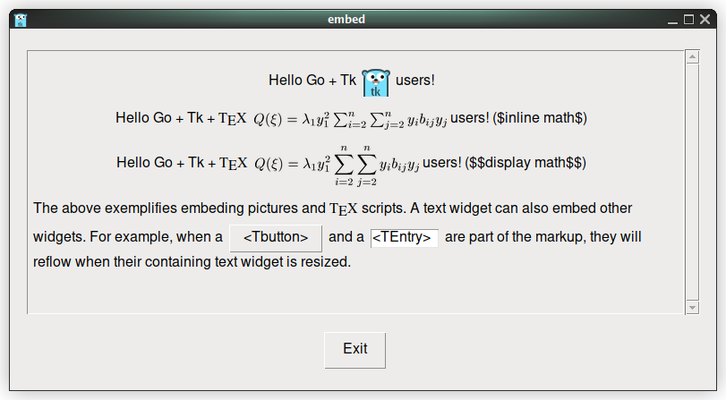

# tk9.0: The CGo-free, cross platform GUI toolkit for Go

Using Go embedded images (_examples/photo.go).

     1	package main
     2	
     3	import _ "embed"
     4	import . "modernc.org/tk9.0"
     5	
     6	//go:embed gopher.png
     7	var gopher []byte
     8	
     9	func main() {
    10		Pack(Label(Image(NewPhoto(Data(gopher)))),
    11			TExit(),
    12			Padx("1m"), Pady("2m"), Ipadx("1m"), Ipady("1m"))
    13		App.Center().Wait()
    14	}

Cascading menus (_examples/menu.go)

     1	package main
     2	
     3	import (
     4		"fmt"
     5		. "modernc.org/tk9.0"
     6		"runtime"
     7	)
     8	
     9	func main() {
    10		menubar := Menu()
    11	
    12		fileMenu := menubar.Menu()
    13		fileMenu.AddCommand(Lbl("New"), Underline(0), Accelerator("Ctrl+N"))
    14		fileMenu.AddCommand(Lbl("Open..."), Underline(0), Accelerator("Ctrl+O"), Command(func() { GetOpenFile() }))
    15		Bind(App, "<Control-o>", Command(func() { fileMenu.Invoke(1) }))
    16		fileMenu.AddCommand(Lbl("Save"), Underline(0), Accelerator("Ctrl+S"))
    17		fileMenu.AddCommand(Lbl("Save As..."), Underline(5))
    18		fileMenu.AddCommand(Lbl("Close"), Underline(0), Accelerator("Crtl+W"))
    19		fileMenu.AddSeparator()
    20		fileMenu.AddCommand(Lbl("Exit"), Underline(1), Accelerator("Ctrl+Q"), ExitHandler())
    21		Bind(App, "<Control-q>", Command(func() { fileMenu.Invoke(6) }))
    22		menubar.AddCascade(Lbl("File"), Underline(0), Mnu(fileMenu))
    23	
    24		editMenu := menubar.Menu()
    25		editMenu.AddCommand(Lbl("Undo"))
    26		editMenu.AddSeparator()
    27		editMenu.AddCommand(Lbl("Cut"))
    28		editMenu.AddCommand(Lbl("Copy"))
    29		editMenu.AddCommand(Lbl("Paste"))
    30		editMenu.AddCommand(Lbl("Delete"))
    31		editMenu.AddCommand(Lbl("Select All"))
    32		menubar.AddCascade(Lbl("Edit"), Underline(0), Mnu(editMenu))
    33	
    34		helpMenu := menubar.Menu()
    35		helpMenu.AddCommand(Lbl("Help Index"))
    36		helpMenu.AddCommand(Lbl("About..."))
    37		menubar.AddCascade(Lbl("Help"), Underline(0), Mnu(helpMenu))
    38	
    39		App.WmTitle(fmt.Sprintf("%s on %s", App.WmTitle(""), runtime.GOOS))
    40		App.Configure(Mnu(menubar), Width("8c"), Height("6c")).Wait()
    41	}

Menus on darwin are now using the system-managed menu bar.    

Rich text using markup (_examples/text.go).

     1	package main
     2	
     3	import . "modernc.org/tk9.0"
     4	
     5	func main() {
     6		var scroll *TScrollbarWidget
     7		t := Text(Font("helvetica", 10), Yscrollcommand(func(e *Event) { e.ScrollSet(scroll) }), Setgrid(true), Wrap("word"), Padx("2m"), Pady("2m"))
     8		scroll = TScrollbar(Command(func(e *Event) { e.Yview(t) }))
     9		Grid(t, Sticky("news"), Pady("2m"))
    10		Grid(scroll, Row(0), Column(1), Sticky("nes"), Pady("2m"))
    11		GridRowConfigure(App, 0, Weight(1))
    12		GridColumnConfigure(App, 0, Weight(1))
    13		Grid(TExit(), Padx("1m"), Pady("2m"), Ipadx("1m"), Ipady("1m"))
    14		t.TagConfigure("bgstipple", Background(Black), Borderwidth(0), Bgstipple(Gray12))
    15		t.TagConfigure("big", Font("helvetica", 12, "bold"))
    16		t.TagConfigure("bold", Font("helvetica", 10, "bold", "italic"))
    17		t.TagConfigure("center", Justify("center"))
    18		t.TagConfigure("color1", Background("#a0b7ce"))
    19		t.TagConfigure("color2", Foreground(Red))
    20		t.TagConfigure("margins", Lmargin1("12m"), Lmargin2("6m"), Rmargin("10m"))
    21		t.TagConfigure("overstrike", Overstrike(1))
    22		t.TagConfigure("raised", Relief("raised"), Borderwidth(1))
    23		t.TagConfigure("right", Justify("right"))
    24		t.TagConfigure("spacing", Spacing1("10p"), Spacing2("2p"), Lmargin1("12m"), Lmargin2("6m"), Rmargin("10m"))
    25		t.TagConfigure("sub", Offset("-2p"), Font("helvetica", 8))
    26		t.TagConfigure("sunken", Relief("sunken"), Borderwidth(1))
    27		t.TagConfigure("super", Offset("4p"), Font("helvetica", 8))
    28		t.TagConfigure("tiny", Font("times", 8, "bold"))
    29		t.TagConfigure("underline", Underline(1))
    30		t.TagConfigure("verybig", Font(CourierFont(), 22, "bold"))
    31		t.InsertML(`Text widgets like this one allow you to display information in a variety of styles. Display styles are controlled
    32	using a mechanism called <bold>tags</bold>. Tags are just textual names that you can apply to one or more ranges of characters within a
    33	text widget. You can configure tags with various display styles. If you do this, then the tagged characters will be displayed with the
    34	styles you chose. The available display styles are:
    35	  <big>1. Font.</big> You can choose any system font, <verybig>large</verybig> or <tiny>small</tiny>.
    36	  <big>2. Color.</big> You can change either the <color1>background</color1> or <color2>foreground</color2> color, or
    37	<color1><color2>both</color2></color1>.
    38	  <big>3. Stippling.</big> You can cause the <bgstipple>background</bgstipple> information to be drawn with a stipple fill instead
    39	of a solid fill.
    40	  <big>4. Underlining.</big> You can <underline>underline</underline> ranges of text.
    41	  <big>5. Overstrikes.</big> You can <overstrike>draw lines through</overstrike> ranges of text.
    42	  <big>6. 3-D effects.</big> You can arrange for the background to be drawn with a border that makes characters appear either
    43	<raised>raised</raised> or <sunken>sunken</sunken>.
    44	  <big>7. Justification.</big> You can arrange for lines to be displayed  left-justified  <right>right-justified, or</right>
    45	 
centered.

    46	  <big>8. Superscripts and subscripts.</big> You can control the vertical position of text to generate superscript effects like
    47	10<super>n</super> or subscript effects like Xi.
    48	  <big>9. Margins.</big> You can control the amount of extra space left on each side of the text
    49	  <margins>This paragraph is an example of the use of margins. It consists of a single line of text that wraps around on the
    50	screen.  There are two separate left margin values, one for the first display line associated with the text line, and one for the
    51	subsequent display lines, which occur because of wrapping. There is also a separate specification for the right margin, which is used to
    52	choose wrap points for lines.</margins>
    53	  <big>10. Spacing.</big> You can control the spacing of lines with three separate parameters. "Spacing1" tells how much extra
    54	space to leave above a line, "spacing3" tells how much space to leave below a line, and if a text line wraps, "spacing2" tells how much
    55	space to leave between the display lines that make up the text line.
    56	 <spacing>These indented paragraphs illustrate how spacing can be used. Each paragraph is actually a single line in the text widget,
    57	which is word-wrapped by the widget.</spacing>
    58	 <spacing>Spacing1 is set to 10 points for this text, which results in relatively large gaps between the paragraphs. Spacing2 is set
    59	to 2 points, which results in just a bit of extra space within a pararaph. Spacing3 isn't used in this example.</spacing>
    60	 <spacing>To see where the space is, select ranges of text within these paragraphs. The selection highlight will cover the extra
    61	space.</spacing>`)
    62		App.Center().Wait()
    63	}

Using svg (_examples/svg.go).

     1	package main
     2	
     3	import . "modernc.org/tk9.0"
     4	
     5	// https://en.wikipedia.org/wiki/SVG
     6	const svg = `<?xml version="1.0" encoding="UTF-8" standalone="no"?>
     7	<!DOCTYPE svg PUBLIC "-//W3C//DTD SVG 1.1//EN" "http://www.w3.org/Graphics/SVG/1.1/DTD/svg11.dtd">
     8	<svg width="391" height="391" viewBox="-70.5 -70.5 391 391" xmlns="http://www.w3.org/2000/svg" xmlns:xlink="http://www.w3.org/1999/xlink">
     9	<rect fill="#fff" stroke="#000" x="-70" y="-70" width="390" height="390"/>
    10	<g opacity="0.8">
    11		<rect x="25" y="25" width="200" height="200" fill="lime" stroke-width="4" stroke="pink" />
    12		<circle cx="125" cy="125" r="75" fill="orange" />
    13		<polyline points="50,150 50,200 200,200 200,100" stroke="red" stroke-width="4" fill="none" />
    14		<line x1="50" y1="50" x2="200" y2="200" stroke="blue" stroke-width="4" />
    15	</g>
    16	</svg>`
    17	
    18	func main() {
    19		Pack(Label(Image(NewPhoto(Data(svg)))),
    20			TExit(),
    21			Padx("1m"), Pady("2m"), Ipadx("1m"), Ipady("1m"))
    22		App.Center().Wait()
    23	}

A simple calculator (_examples/calc.go).

     1	package main
     2	
     3	import "github.com/expr-lang/expr"
     4	import . "modernc.org/tk9.0"
     5	
     6	func main() {
     7		out := Label(Height(2), Anchor("e"), Txt("(123+232)/(123-10)"))
     8		Grid(out, Columnspan(4), Sticky("e"))
     9		var b *ButtonWidget
    10		for i, c := range "C()/789*456-123+0.=" {
    11			b = Button(Txt(string(c)),
    12				Command(
    13					func() {
    14						switch c {
    15						case 'C':
    16							out.Configure(Txt(""))
    17						case '=':
    18							x, err := expr.Eval(out.Txt(), nil)
    19							if err != nil {
    20								MessageBox(Icon("error"), Msg(err.Error()), Title("Error"))
    21								x = ""
    22							}
    23							out.Configure(Txt(x))
    24						default:
    25							out.Configure(Txt(out.Txt() + string(c)))
    26						}
    27					},
    28				),
    29				Width(-4))
    30			Grid(b, Row(i/4+1), Column(i%4), Sticky("news"), Ipadx("1.5m"), Ipady("2.6m"))
    31		}
    32		Grid(b, Columnspan(2))
    33		App.Configure(Padx(0), Pady(0)).Wait()
    34	}

A font previewer (_examples/font.go).

     1	package main
     2	
     3	import "fmt"
     4	import "slices"
     5	import . "modernc.org/tk9.0"
     6	
     7	func main() {
     8		var scroll *TScrollbarWidget
     9		t := Text(Wrap("none"), Setgrid(true), Yscrollcommand(func(e *Event) { e.ScrollSet(scroll) }))
    10		scroll = TScrollbar(Command(func(e *Event) { e.Yview(t) }))
    11		fonts := FontFamilies()
    12		slices.Sort(fonts)
    13		Grid(t, Sticky("news"), Pady("2m"), Ipadx("1m"), Ipady("1m"))
    14		Grid(scroll, Row(0), Column(1), Sticky("nes"), Pady("2m"))
    15		GridRowConfigure(App, 0, Weight(1))
    16		GridColumnConfigure(App, 0, Weight(1))
    17		Grid(TExit(), Padx("1m"), Pady("2m"), Ipadx("1m"), Ipady("1m"))
    18		m := map[string]bool{}
    19		for i, font := range fonts {
    20			if m[font] {
    21				continue
    22			}
    23			m[font] = true
    24			tag := fmt.Sprintf("t%v", i)
    25			t.TagConfigure(tag, Font(NewFont(Family(font))))
    26			t.Insert("end", font+": ", "", "Lorem ipsum dolor sit amet, consectetur adipiscing elit...\n", tag)
    27		}
    28		App.Center().Wait()
    29	}

Surface plot (_examples/splot.go). This example requires Gnuplot 5.4+ installation.

     1	package main
     2	
     3	import . "modernc.org/tk9.0"
     4	
     5	var cm = int(TkScaling()*72/2.54 + 0.5)
     6	
     7	func main() {
     8		Pack(Label(Image(NewPhoto(Width(20*cm), Height(15*cm)).Graph("set grid; splot x**2+y**2, x**2-y**2"))),
     9			TExit(),
    10			Padx("1m"), Pady("2m"), Ipadx("1m"), Ipady("1m"))
    11		App.Center().Wait()
    12	}

Interlocked tori plot (_examples/tori.go). This example requires Gnuplot 5.4+ installation.

     1	package main
     2	
     3	import . "modernc.org/tk9.0"
     4	
     5	// https://gnuplot.sourceforge.net/demo_5.4/hidden2.html
     6	const script = `
     7	set multiplot title "Interlocking Tori"
     8	set title "PM3D surface\nno depth sorting"
     9	set parametric
    10	set urange [-pi:pi]
    11	set vrange [-pi:pi]
    12	set isosamples 50,20
    13	set origin -0.02,0.0
    14	set size 0.55, 0.9
    15	unset key
    16	unset xtics
    17	unset ytics
    18	unset ztics
    19	set border 0
    20	set view 60, 30, 1.5, 0.9
    21	unset colorbox
    22	set pm3d scansbackward
    23	splot cos(u)+.5*cos(u)*cos(v),sin(u)+.5*sin(u)*cos(v),.5*sin(v) with pm3d,1+cos(u)+.5*cos(u)*cos(v),.5*sin(v),sin(u)+.5*sin(u)*cos(v) with pm3d
    24	set title "PM3D surface\ndepth sorting"
    25	set origin 0.40,0.0
    26	set size 0.55, 0.9
    27	set colorbox vertical user origin 0.9, 0.15 size 0.02, 0.50
    28	set format cb "%.1f"
    29	set pm3d depthorder
    30	splot cos(u)+.5*cos(u)*cos(v),sin(u)+.5*sin(u)*cos(v),.5*sin(v) with pm3d,1+cos(u)+.5*cos(u)*cos(v),.5*sin(v),sin(u)+.5*sin(u)*cos(v) with pm3d
    31	unset multiplot`
    32	
    33	var cm = int(TkScaling()*72/2.54 + 0.5)
    34	
    35	func main() {
    36		Pack(Label(Image(NewPhoto(Width(20*cm), Height(15*cm)).Graph(script))),
    37			TExit(),
    38			Padx("1m"), Pady("2m"), Ipadx("1m"), Ipady("1m"))
    39		App.Center().Wait()
    40	}

Interlocked tori plot on canvas (_examples/tori_canvas.go). This example requires Gnuplot 5.4+ installation.

     1	package main
     2	
     3	import . "modernc.org/tk9.0"
     4	
     5	// https://gnuplot.sourceforge.net/demo_5.4/surface2.9.gnu
     6	const script = `
     7	set dummy u, v
     8	set key bmargin center horizontal Right noreverse enhanced autotitle nobox
     9	set parametric
    10	set view 50, 30, 1, 1
    11	set isosamples 50, 20
    12	set hidden3d back offset 1 trianglepattern 3 undefined 1 altdiagonal bentover
    13	set style data lines
    14	set xyplane relative 0
    15	set title "Interlocking Tori" 
    16	set grid
    17	set urange [ -3.14159 : 3.14159 ] noreverse nowriteback
    18	set vrange [ -3.14159 : 3.14159 ] noreverse nowriteback
    19	set xrange [ * : * ] noreverse writeback
    20	set x2range [ * : * ] noreverse writeback
    21	set yrange [ * : * ] noreverse writeback
    22	set y2range [ * : * ] noreverse writeback
    23	set zrange [ * : * ] noreverse writeback
    24	set cbrange [ * : * ] noreverse writeback
    25	set rrange [ * : * ] noreverse writeback
    26	set colorbox vertical origin screen 0.9, 0.2 size screen 0.05, 0.6 front  noinvert bdefault
    27	NO_ANIMATION = 1
    28	splot cos(u)+.5*cos(u)*cos(v),sin(u)+.5*sin(u)*cos(v),.5*sin(v) with lines,1+cos(u)+.5*cos(u)*cos(v),.5*sin(v),sin(u)+.5*sin(u)*cos(v) with lines`
    29	
    30	var cm = int(TkScaling()*72/2.54 + 0.5)
    31	
    32	func main() {
    33		Pack(Canvas(Width(20*cm), Height(15*cm), Background(White)).Graph(script),
    34			TExit(),
    35			Padx("1m"), Pady("2m"), Ipadx("1m"), Ipady("1m"))
    36		App.Center().Wait()
    37	}

Rendering plain TeX (_examples/tex.go). No runtime dependencies required.

     1	package main
     2	
     3	import . "modernc.org/tk9.0"
     4	
     5	func main() {
     6		tex := `$$\int _0 ^\infty {{\sin ax \sin bx}\over{x^2}}\,dx = {\pi a\over 2}$$`
     7		Pack(Label(Relief("sunken"), Image(NewPhoto(Data(TeX(tex, 2*TkScaling()*72/600))))),
     8			TExit(),
     9			Padx("1m"), Pady("2m"), Ipadx("1m"), Ipady("1m"))
    10		App.Center().Wait()
    11	}

Embedding pictures, TeX and other widgets in Text (_examples/embed.go).

     1	package main
     2	
     3	import . "modernc.org/tk9.0"
     4	import _ "embed"
     5	
     6	//go:embed gotk.png
     7	var icon []byte
     8	
     9	func main() {
    10		fontSize := int(10*TkScaling()/NativeScaling + 0.5)
    11		font := Font("helvetica", fontSize)
    12		var scroll *TScrollbarWidget
    13		t := Text(font, Height(15), Yscrollcommand(func(e *Event) { e.ScrollSet(scroll) }), Setgrid(true), Wrap("word"),
    14			Padx("4p"), Pady("12p"))
    15		scroll = TScrollbar(Command(func(e *Event) { e.Yview(t) }))
    16		Grid(t, Sticky("news"), Pady("2m"))
    17		Grid(scroll, Row(0), Column(1), Sticky("nes"), Pady("2m"))
    18		GridRowConfigure(App, 0, Weight(1))
    19		GridColumnConfigure(App, 0, Weight(1))
    20		Grid(Exit().Configure(font), Padx("1m"), Pady("2m"), Ipadx("1m"), Ipady("1m"))
    21		t.TagConfigure("c", Justify("center"))
    22		t.TagConfigure("e", Offset("-2p"))
    23		t.TagConfigure("t", Font("times", fontSize))
    24		sym := " <t>T<e>E</e>X</t> "
    25		tex := `$Q(\xi) = \lambda_1 y_1^2 \sum_{i=2}^n \sum_{j=2}^n y_i b_{ij} y_j$`
    26		t.InsertML(`<c>Hello Go + Tk`, NewPhoto(Data(icon)), Padx("4p"), `users!
    27	  Hello Go + Tk +`, sym, tex, ` users! (\$inline math\$)
    28	  Hello Go + Tk +`, sym, `$`+tex+`$`, ` users! (\$\$display math\$\$)</c>
    29	  The above exemplifies embeding pictures and`, sym, `scripts. A text widget can also embed other widgets. For example,
    30	when a`, Button(font, Txt("<Tbutton>")), Padx("4p"), Pady("2p"), Align("center"), `and
    31	a`, Entry(font, Textvariable("<TEntry>"), Background(White), Width(8)), Padx("4p"), Pady("2p"), Align("center"), `are part of
    32	the markup, they will reflow when their containing text widget is resized.`)
    33		App.Center().Wait()
    34	}

This program additionally demonstrates some techniques for handling non-default scale factors.

The above screen shot is from '$ TK9_SCALE=1.2 go run _examples/embed.go'.

Styling a button (_examples/tbutton.go). See the discussion at [Tutorial: Modifying a ttk button's style]

     1	package main
     2	
     3	import _ "embed"
     4	import . "modernc.org/tk9.0"
     5	
     6	//go:embed red_corner.png
     7	var red []byte
     8	
     9	//go:embed green_corner.png
    10	var green []byte
    11	
    12	func main() {
    13		StyleElementCreate("Red.Corner.TButton.indicator", "image", NewPhoto(Data(red)))
    14		StyleElementCreate("Green.Corner.TButton.indicator", "image", NewPhoto(Data(green)))
    15		StyleLayout("Red.Corner.TButton",
    16			"Button.border", Sticky("nswe"), Border(1), Children(
    17				"Button.focus", Sticky("nswe"), Children(
    18					"Button.padding", Sticky("nswe"), Children(
    19						"Button.label", Sticky("nswe"),
    20						"Red.Corner.TButton.indicator", Side("right"), Sticky("ne")))))
    21		StyleLayout("Green.Corner.TButton",
    22			"Button.border", Sticky("nswe"), Border(1), Children(
    23				"Button.focus", Sticky("nswe"), Children(
    24					"Button.padding", Sticky("nswe"), Children(
    25						"Button.label", Sticky("nswe"),
    26						"Green.Corner.TButton.indicator", Side("right"), Sticky("ne")))))
    27		opts := Opts{Padx("1m"), Pady("2m"), Ipadx("1m"), Ipady("1m")}
    28		rb := TButton(Txt("Red"))
    29		gb := TButton(Txt("Green"))
    30		Grid(rb, gb, opts)
    31		Grid(TButton(Txt("Use style"), Command(func() {
    32			rb.Configure(Style("Red.Corner.TButton"))
    33			gb.Configure(Style("Green.Corner.TButton"))
    34		})), TExit(), opts)
    35		App.Wait()
    36	}

Technology preview of a Bootstrap 5-like theme buttons (_examples/b5.go). Only
a partial prototype/problem study/work in progress at the moment. But it may
get there, eventually.

     1	package main
     2	
     3	import (
     4		. "modernc.org/tk9.0"
     5		"modernc.org/tk9.0/b5"
     6	)
     7	
     8	func main() {
     9		background := White
    10		primary := b5.Colors{b5.ButtonText: "#fff", b5.ButtonFace: "#0d6efd", b5.ButtonFocus: "#98c1fe"}
    11		secondary := b5.Colors{b5.ButtonText: "#fff", b5.ButtonFace: "#6c757d", b5.ButtonFocus: "#c0c4c8"}
    12		success := b5.Colors{b5.ButtonText: "#fff", b5.ButtonFace: "#198754", b5.ButtonFocus: "#9dccb6"}
    13		danger := b5.Colors{b5.ButtonText: "#fff", b5.ButtonFace: "#dc3545", b5.ButtonFocus: "#f0a9b0"}
    14		warning := b5.Colors{b5.ButtonText: "#000", b5.ButtonFace: "#ffc107", b5.ButtonFocus: "#ecd182"}
    15		info := b5.Colors{b5.ButtonText: "#000", b5.ButtonFace: "#0dcaf0", b5.ButtonFocus: "#85d5e5"}
    16		light := b5.Colors{b5.ButtonText: "#000", b5.ButtonFace: "#f8f9fa", b5.ButtonFocus: "#e9e9ea"}
    17		dark := b5.Colors{b5.ButtonText: "#fff", b5.ButtonFace: "#212529", b5.ButtonFocus: "#a0a2a4"}
    18		link := b5.Colors{b5.ButtonText: "#1774fd", b5.ButtonFace: "#fff", b5.ButtonFocus: "#c2dbfe"}
    19		StyleThemeUse("default")
    20		opts := Opts{Padx("1m"), Pady("2m"), Ipadx("1m"), Ipady("1m")}
    21		Grid(TButton(Txt("Primary"), Style(b5.ButtonStyle("primary.TButton", primary, background, false))),
    22			TButton(Txt("Secondary"), Style(b5.ButtonStyle("secondary.TButton", secondary, background, false))),
    23			TButton(Txt("Success"), Style(b5.ButtonStyle("success.TButton", success, background, false))),
    24			opts)
    25		Grid(TButton(Txt("Danger"), Style(b5.ButtonStyle("danger.TButton", danger, background, false))),
    26			TButton(Txt("Warning"), Style(b5.ButtonStyle("warning.TButton", warning, background, false))),
    27			TButton(Txt("Info"), Style(b5.ButtonStyle("info.TButton", info, background, false))),
    28			opts)
    29		Grid(TButton(Txt("Light"), Style(b5.ButtonStyle("light.TButton", light, background, false))),
    30			TButton(Txt("Dark"), Style(b5.ButtonStyle("dark.TButton", dark, background, false))),
    31			TButton(Txt("Link"), Style(b5.ButtonStyle("link.TButton", link, background, false))),
    32			opts)
    33		Grid(TButton(Txt("Primary"), Style(b5.ButtonStyle("focused.primary.TButton", primary, background, true))),
    34			TButton(Txt("Secondary"), Style(b5.ButtonStyle("focused.secondary.TButton", secondary, background, true))),
    35			TButton(Txt("Success"), Style(b5.ButtonStyle("focused.success.TButton", success, background, true))),
    36			opts)
    37		Grid(TButton(Txt("Danger"), Style(b5.ButtonStyle("focused.danger.TButton", danger, background, true))),
    38			TButton(Txt("Warning"), Style(b5.ButtonStyle("focused.warning.TButton", warning, background, true))),
    39			TButton(Txt("Info"), Style(b5.ButtonStyle("focused.info.TButton", info, background, true))),
    40			opts)
    41		Grid(TButton(Txt("Light"), Style(b5.ButtonStyle("focused.light.TButton", light, background, true))),
    42			TButton(Txt("Dark"), Style(b5.ButtonStyle("focused.dark.TButton", dark, background, true))),
    43			TButton(Txt("Link"), Style(b5.ButtonStyle("focused.link.TButton", link, background, true))),
    44			opts)
    45		Grid(TExit(), Columnspan(3), opts)
    46		App.Configure(Background(background)).Wait()
    47	}

----

Gallery (_examples/demo.go)

Darwin(macOS) Sequoia 15.0

FreeBSD Xfce4

Linux Mate 1.26.0

Windows 11

[Tutorial: Modifying a ttk button's style]: https://wiki.tcl-lang.org/page/Tutorial%3A+Modifying+a+ttk+button%27s+style
